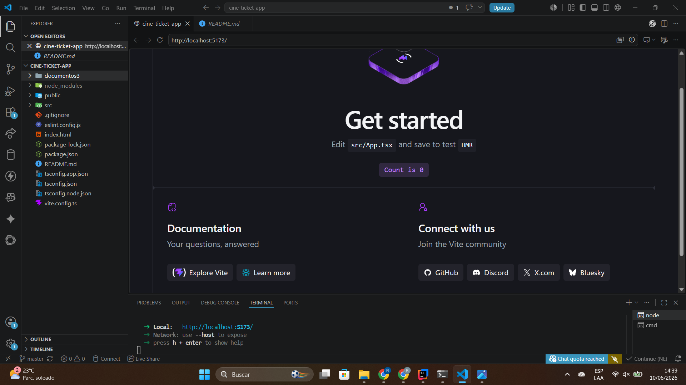
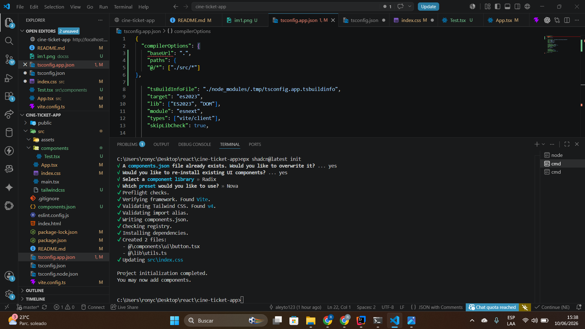
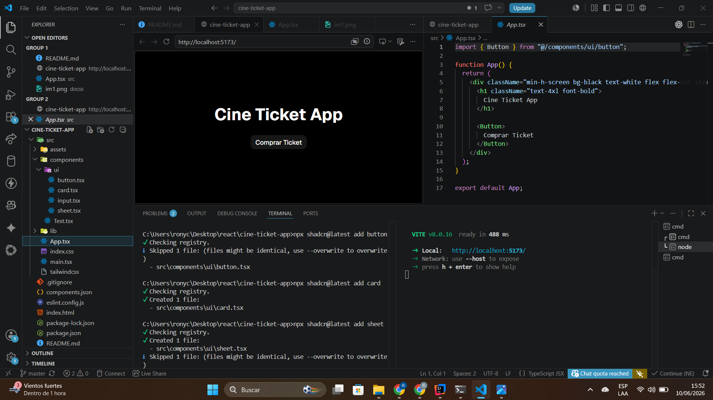
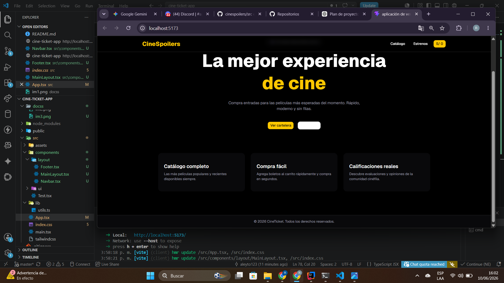

## LABORATORIO 13 DE DESARROLLO DE APLICACIONES EMPRESARIALES
## INTEGRANTES: 
### 1. Bellido Chambi Rony Widmer
### 2. Rojas Tello, Mauricio Lucianno
### 3. Xiomara Garcia Silva

# 📸 Capturas del proyecto
#

# 1. Bellido Chambi Rony Widmer

### 🔹 Creación del proyecto con Vite + React + TypeScript:

### 🔹 Instalación y configuración de Tailwind CSS:

### 🔹 Instalación de shadcn/ui y componentes:

### 🔹 Layout con Navbar usando shadcn/ui:

